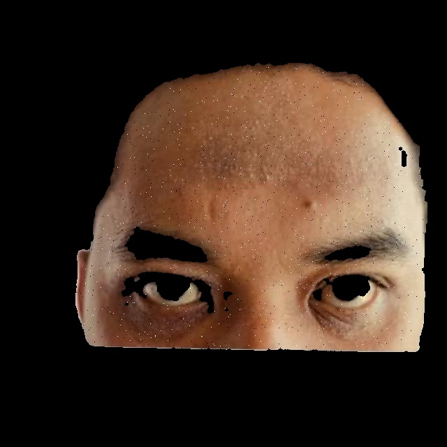
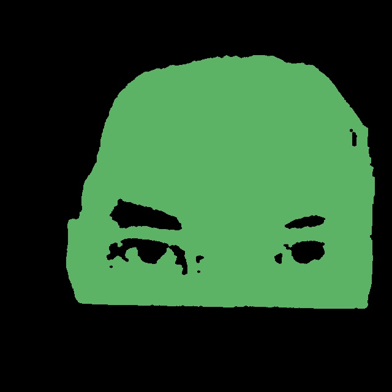

# Skin Segmentation Dataset Builder

An automated tool for converting **skin classification datasets** into **background-free skin segmentation datasets**, with a strong focus on **facial skin segmentation**, while still supporting **non-face skin images**.

This project is designed for **rapid prototyping**, **research**, and **production-ready dataset bootstrapping**.

---

## 🚀 What Problem Does This Solve?

Most publicly available skin datasets are **classification datasets**, structured like:

```
dataset_original/
├── train/
│   ├── Normal Skin/
│   ├── Acne/
│   └── ...
├── valid/
└── test/
```

These datasets are excellent for classification, but **not usable for segmentation tasks** without manual annotation.

Segmentation models require:

* Pixel-level masks
* A different dataset structure
* Careful handling of background pixels

### The Core Challenge

In skin segmentation:

* Background pixels dominate images
* Background becomes an overpowering class
* This introduces noise, imbalance, and poor generalization
* Even cropped face images still contain:

  * Hair
  * Eyes
  * Nostrils
  * Clothing
  * Background artifacts

### This Tool Solves That By:

✅ Automatically detecting **skin regions only**
✅ Producing **standalone skin images**
✅ Producing **standalone skin masks**
✅ **Removing background entirely** (no background class)
✅ Preserving **train / valid / test splits**
✅ Working with:

* Face images (selfies)
* Partial skin images (arms, cheeks, neck, forehead)
* Skin-only datasets

---

## 🧠 Key Idea

Instead of labeling background pixels as a class, this tool:

> **Removes all non-skin pixels altogether**

This results in:

* Cleaner segmentation datasets
* No background domination
* Better class balance
* Faster convergence during training

---

## 🧩 How It Works (High Level)

For each image:

1. Attempt **face detection** (optional)
2. If a face is detected:

   * Prefer face crop (less noise)
3. If no face is detected:

   * Process the full image
4. Detect **skin pixels only**
5. Generate:

   * Skin-only image
   * Binary skin mask
6. Save outputs in segmentation dataset format
7. Generate **colorized mask previews** for human inspection (optional)

Face detection is **optional and non-blocking**.

---

## 🛠 Tools & Technologies Used

* **Python**
* **OpenCV** – image processing
* **MediaPipe** – optional face detection
* **HSV + YCrCb color space filtering** – skin detection
* **Morphological operations** – mask cleanup

No pretrained segmentation model is required.

---

## 📂 Input Dataset Format (Required)

The tool expects a **classification dataset** structured as follows:

```
dataset_original/
├── train/
│   ├── Normal Skin/
│   ├── Acne/
│   └── ...
├── valid/
│   ├── Normal Skin/
│   ├── Acne/
│   └── ...
└── test/
    ├── Normal Skin/
    ├── Acne/
    └── ...
```

---

## 📦 Output Dataset Format (Generated)

```
dataset/
├── images/
│   ├── train/
│   ├── valid/
│   └── test/
├── masks/
│   ├── train/
│   ├── valid/
│   └── test/
├── masks_preview/      # colorized human-readable masks
│   ├── train/
│   ├── valid/
│   └── test/
└── classes.txt
```

* `masks_preview` contains **colorized masks for visualization** only; **integer masks** in `masks` are used for training.

## 🖼 Example Output (Single Sample)

Below is a visual example showing how a single image is transformed by the pipeline.

<table>
   <tr>
      <td align="center"><b>Original Image</b></td>
      <td align="center"><b>Skin-only Image</b></td>
      <td align="center"><b>Training Mask</b></td>
      <td align="center"><b>Preview Mask</b></td>
   </tr>
   <tr>
      <td>
         
      </td>
      <td>
         
      </td>
      <td>
         
      </td>
      <td>
         
      </td>
   </tr>
</table>

### Why the Training Mask Looks Almost Black

The **training mask** is stored as a single-channel image where each pixel value represents a **class ID**, not a color.

For example:
- `0` → background (ignored during training)
- `1` → dry skin
- `2` → normal skin
- `3` → oily skin
- ...

Since these values are small integers, they appear **very dark or almost invisible** when viewed as a normal image.

This is intentional.

Segmentation models require **integer-valued masks**, not RGB images.  
The colorized **preview mask** is generated purely for **human inspection** and is **never used during training**.

### Preview Mask Legend

The preview mask uses a fixed color mapping to visualize different skin classes:

- Each color represents a unique skin type or condition
- Colors are assigned automatically and consistently
- Preview masks exist only for debugging and quality checks

---

## 🔧 Installation

```bash
pip install -r requirements.txt
```

---

## ▶️ Usage

```bash
python build_dataset.py
```

* The tool will automatically process `train`, `valid`, and `test` splits
* Colorized mask previews will be generated in `dataset/masks_preview`
* Use **CrossEntropyLoss(ignore_index=0)** in PyTorch or equivalent in other frameworks

  * Ensures background pixels are ignored during training
  * Only actual skin pixels contribute to learning

---

## 📜 License

MIT License

---

## 📬 Contact & Support

**Michael Panashe Mudimbu**
📧 Email: **[michaelmudimbu@gmail.com](mailto:michaelmudimbu@gmail.com)**
